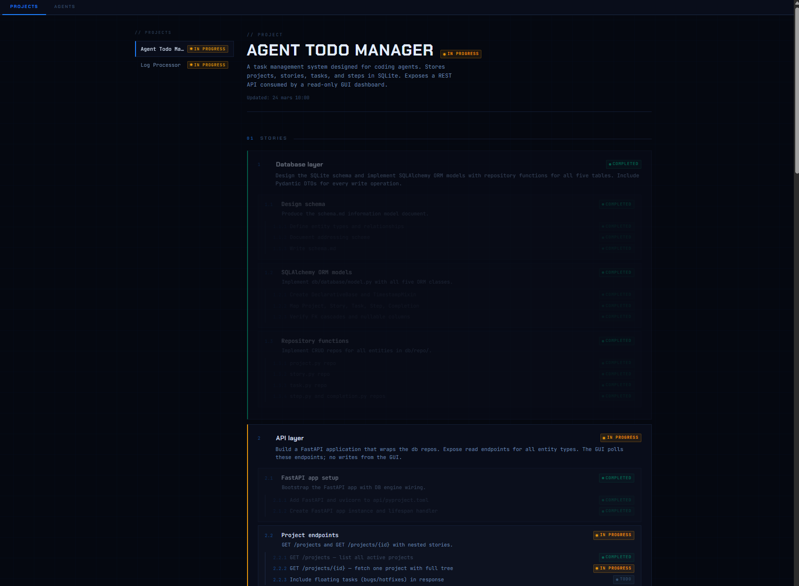

# Agent Todo Manager


## Overview

A state management system with a structured database at its core, exposed via a Python CLI for agent interaction, a thin FastAPI backend for the GUI, and a Vite frontend for state visibility.

## Architecture

| Module | Role |
|--------|------|
| `db`      | Schema, migrations, and source of truth for all project state |
| `atm-cli` | Agent-facing interface, reads and mutates state directly via the DB |
| `api`     | Thin FastAPI layer, serves state to the GUI |
| `gui`     | Vite dashboard, renders live state via the API |

## Modules

### `db`
The source of truth. All state lives here. The other three modules are downstream of it.

See the db [schema](./db/quick_reference.md) for the information model.

### `cli`
Built for agent consumption, not humans. Hits the DB directly.

- **Output:** Always JSON to stdout. No envelope wrapping. Nulls and empty fields stripped.
- **Errors:** Structured JSON to stdout: `{"error": "code", "context": "..."}`. Diagnostics and logs to stderr only.
- **No interactive prompts. Ever.**
- **Exit codes:** `0` success, `1` user error, `2` system error.
- **Stack:** Python + [Typer](https://typer.tiangolo.com/) + Pydantic (`model_dump(exclude_none=True)`)

### `api`
Thin [FastAPI](https://fastapi.tiangolo.com/) service. Bridges the DB and the GUI. Not a general-purpose API.

### `gui`
[Vite](https://vitejs.dev/) dashboard for observing live state. Two views:

- **Projects** — sidebar lists all projects; selecting one shows stories, tasks, steps, bugs, hotfixes, and activity feed
- **Agents** — shows all in-progress tasks across all projects, grouped by the agent working on each

No business logic. Read-only.

## Getting Started

**Prerequisites:** Python 3.12+, [uv](https://docs.astral.sh/uv/), Node.js 18+

### 1. Configure the database

```sh
cp .env.example .env
# Edit .env and set: ATM_DATABASE_URL=sqlite:////absolute/path/to/app.db
```

### 2. Install dependencies

```sh
uv sync       # Python (db + api)
cd gui && npm install
```

### 3. Run migrations

```sh
cd db
uv run alembic upgrade head
```

### 4. Start the API

```sh
cd api
uv run uvicorn main:app --reload
# → http://localhost:8000
```

### 5. Start the GUI

```sh
cd gui
npm run dev
# → http://localhost:5173
```

### 6. Create a project

```sh
uv run atm admin projects create --title "My Project"
```

This prints the project UUID — save it. You will set it as `ATM_PROJECT_ID` in the next step.

To list existing projects:

```sh
uv run atm admin projects list
```

### 7. Install agent skills

Copy the ATM skill directory into the target project's Claude Code skills folder:

```sh
cp -r resources/skills/atm /path/to/your/project/.claude/skills/atm
```

This installs three skills:

| Skill file | Slash command | Role |
|---|---|---|
| `.claude/skills/atm/SKILL.md` | `/atm` | Common foundation — load this first |
| `.claude/skills/atm/pm-agent/SKILL.md` | `/atm:pm-agent` | PM agent — plans stories, tasks, steps |
| `.claude/skills/atm/dev-agent/SKILL.md` | `/atm:dev-agent` | Dev agent — executes steps |

### 8. Configure agent environment

Every agent session needs two environment variables:

| Variable | Value | Description |
|---|---|---|
| `ATM_PROJECT_ID` | UUID from step 6 | Default project for all `--project` flags |
| `ATM_SESSION_ID` | A unique UUID per session | Ties completions to a specific agent run — generate a fresh one each time you spawn an agent (e.g. `python -c "import uuid; print(uuid.uuid4())"`) |

Set these before spawning an agent:

```sh
export ATM_PROJECT_ID=<uuid from step 6>
export ATM_SESSION_ID=$(python -c "import uuid; print(uuid.uuid4())")
```

## What We're NOT Optimizing For

- Pretty CLI output
- Shell completion
- Rich formatting (`TYPER_USE_RICH=0` in agent context)
